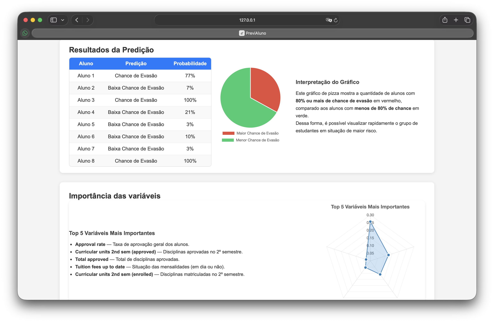

# PreviAluno — Predição de Evasão Acadêmica

---

**PreviAluno** é uma aplicação web que utiliza Machine Learning para prever a probabilidade de evasão ou reprovação de alunos com base em dados acadêmicos e socioeconômicos. A ferramenta permite o upload de conjuntos de dados em formato CSV, processa as informações através de um modelo de ensemble e apresenta os resultados de forma visual e intuitiva por meio de dashboards.

<p align="center">
  <!-- Espaço para imagem da aplicação -->
  
</p>


---

## 🎓 Contexto Acadêmico

Este projeto foi desenvolvido como parte integrante de um **PIBIT (Programa Institucional de Bolsas de Iniciação em Desenvolvimento Tecnológico e Inovação)**.

A aplicação tem como objetivos principais:
1.  **Identificação Precoce:** Detectar alunos em situação de risco acadêmico antes que a evasão ocorra.
2.  **Apoio à Decisão:** Fornecer dados concretos para que gestores educacionais possam implementar políticas de retenção mais assertivas.
3.  **Análise de Variáveis:** Demonstrar quais fatores (como taxa de aprovação e mensalidades em dia) possuem maior impacto no sucesso do estudante.

---

## 🛠️ Stack Tecnológica

### Backend
- **Linguagem:** Python
- **Framework Web:** Flask
- **Machine Learning:** Scikit-learn, XGBoost, LightGBM, CatBoost
- **Manipulação de Dados:** Pandas, NumPy
- **Serialização:** Joblib, Pickle

### Frontend
- **Estrutura:** HTML5 e CSS3 (Design Responsivo)
- **Linguagem:** JavaScript (Vanilla)
- **Visualização de Dados:** Chart.js

---

## 🚀 Como Rodar o Projeto

### Pré-requisitos
- **Python** (v3.10 ou superior recomendado)
- **Gerenciador de pacotes pip**

### 🏃 Execução Passo a Passo

1. **Clone o repositório:**
   ```bash
   git clone https://github.com/seu-usuario/PreviAluno.git
   cd PreviAluno
   ```

2. **Crie e ative um ambiente virtual (opcional, mas recomendado):**
   ```bash
   # Windows
   python -m venv venv
   .\venv\Scripts\activate

   # Linux/macOS
   python3 -m venv venv
   source venv/bin/activate
   ```

3. **Instale as dependências:**
   ```bash
   pip install -r requirements.txt
   ```

4. **Inicie a aplicação:**
   ```bash
   python app.py
   ```

5. **Acesse no navegador:**
   O servidor estará rodando em `http://127.0.0.1:5000`.

---

## 📊 Funcionalidades

- **Upload de Dataset:** Área para envio de arquivos `.csv` contendo os dados dos alunos.
- **Processamento em Tempo Real:** Limpeza de dados, feature engineering e predição automatizada.
- **Dashboard de Resultados:**
    - Tabela detalhada com predição de status e probabilidade por aluno.
    - Gráfico de pizza indicando o percentual de alunos com alto risco de evasão (>= 80%).
    - Gráfico de radar exibindo a importância das variáveis (Top 5 features).
- **Exportação:** O sistema gera automaticamente um arquivo `resultado_dataset.csv` na pasta `uploads/` com todas as predições e níveis de confiança.

---

## 📂 Estrutura do Projeto

- `app.py`: Servidor Flask e lógica de pré-processamento/predição.
- `dropout_prediction_model/`: Contém o modelo treinado (`ensemble_model.pkl`) e artefatos (encoders, metadados).
- `static/`: Arquivos estáticos (CSS, JavaScript, imagens).
- `templates/`: Template principal da interface web.
- `uploads/`: Armazenamento temporário dos arquivos enviados e resultados gerados.

---
Desenvolvido por **[mericxy](https://github.com/mericxy)** como parte de pesquisa tecnológica e inovação.
